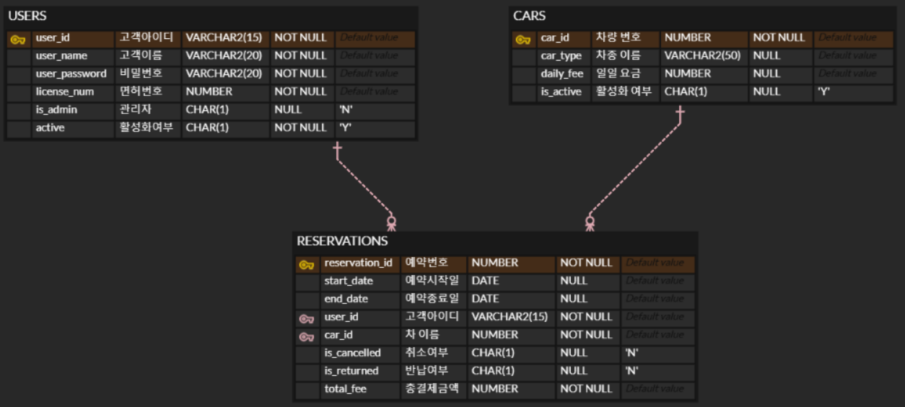

# 요구사항 명세서

## 1. 회원 관리 서비스

### 1.1 회원 가입
**요구사항 ID:** UM-001

**서비스:** 회원 가입 서비스

**기능 설명:** 새로운 사용자가 차량 렌트 서비스를 사용하기 위해 계정을 생성할 수 있도록 하는 기능입니다.

**요구사항:**
- 사용자는 아이디, 이름, 비밀번호, 면허번호를 입력하여 회원가입을 해야 한다.
- 아이디는 중복이 없어야 한다.
- 회원가입 성공 후, 환영 메시지와 함께 메인 메뉴로 이동한다.
- 관리자 아이디는 자동적으로 생성되어야 한다.

**우선순위:** 필수

**비고:** 회원 가입 시, 기본적으로 is_admin 값은 'N'으로 설정.

### 1.2 로그인
**요구사항 ID:** UM-002

**서비스:** 로그인 서비스

**기능 설명:** 기존 회원이 로그인하여 시스템을 이용할 수 있도록 하는 기능입니다.

**요구사항:**
- 사용자는 아이디와 비밀번호를 입력하여 로그인해야 한다.
- 로그인 성공 시, 메인 화면으로 이동한다.
- 아이디, 비밀번호 틀릴 경우 로그인할 수 없다.
- 탈퇴한 회원은 로그인할 수 없다.

**우선순위:** 필수

**비고:** 로그인 실패 시, 오류 메시지를 표시한다.

### 1.3 로그아웃
**요구사항 ID:** UM-003

**서비스:** 로그아웃 서비스

**기능 설명:** 사용자가 시스템에서 로그아웃하고, 로그인 화면 또는 메인 화면으로 이동할 수 있도록 하는 기능입니다.

**요구사항:**
- 사용자는 로그아웃을 요청하면 세션을 종료해야 한다.
- 로그아웃 후, 로그인 화면이나 메인 화면으로 이동한다.

**우선순위:** 필수

**비고:** 로그아웃 시 사용자 정보가 초기화되고, 다시 로그인해야 서비스 이용이 가능하다.

### 1.4 회원 탈퇴
**요구사항 ID:** UM-004

**서비스:** 회원 탈퇴 서비스

**기능 설명:** 사용자가 계정을 탈퇴하여 더 이상 서비스를 이용하지 못하도록 설정하는 기능입니다.

**요구사항:**
- 사용자는 아이디와 비밀번호를 입력하여 회원 탈퇴를 요청할 수 있다.
- 회원 탈퇴 시, 회원의 active 상태가 'N'으로 변경된다. (비활성화)

**우선순위:** 필수

**비고:** 탈퇴 후, 해당 아이디는 로그인할 수 없다.

## 2. 차량 관리 서비스

### 2.1 차량 등록
**요구사항 ID:** CM-001

**서비스:** 차량 등록 서비스

**기능 설명:** 관리자가 시스템에 새로운 차량을 등록하는 기능입니다.

**요구사항:**
- 차량 정보 (차종, 일일 대여료, 활성화 여부)를 입력한다.

**우선순위:** 필수

**비고:** 차량 정보에 누락된 항목이 없도록 한다.

### 2.2 차량 상태 변경
**요구사항 ID:** CM-002

**서비스:** 차량 상태 변경 서비스

**기능 설명:** 관리자가 차량의 대여 가능/불가 상태를 변경할 수 있는 기능입니다.

**요구사항:** 
- 차량의 대여 가능 여부를 변경할 수 있다 (대여 가능 / 대여 불가).
- 차량 상태가 '대여 불가'로 설정되면, 사용자는 해당 차량을 예약할 수 없다.

**우선순위:** 필수

## 3. 예약 관리 서비스

### 3.1 차량 예약
**요구사항 ID:** RM-001

**서비스:** 차량 예약 서비스

**기능 설명:** 사용자가 차량을 예약하는 기능입니다.

**요구사항:**
- 사용자는 예약할 차량을 선택하고 예약 기간을 설정할 수 있다.
- 예약이 완료되면 예약 내역이 시스템에 저장된다.
- 예약한 차량은 예약시작일에 '대여중' 상태로 변경된다.
- 예약 종료일에 '대여중' 상태에서 대여가능 상태로 변경된다.

**우선순위:** 필수

**비고:** 
- 예약 시, 차량이 대여 가능 상태여야만 예약이 가능하다.
- 차량 예약은 1일 단위로 가능하다.

### 3.2 예약 취소
**요구사항 ID:** RM-002

**서비스:** 예약 취소 서비스

**기능 설명:** 사용자가 예약을 취소하는 기능입니다.

**요구사항:**
- 사용자는 예약 내역을 확인하고 예약을 취소할 수 있다.
- 예약 취소 후, 차량은 다시 '대여 가능' 상태로 변경된다.

**우선순위:** 필수

### 3.3 예약 내역 조회
**요구사항 ID:** RM-003

**서비스:** 예약 내역 조회 서비스

**기능 설명:**
- 사용자가 자신이 예약한 차량 내역을 조회하는 기능입니다.
- 과거의 예약 내역 및 취소 내역 등 모든 내역을 조회하는 기능입니다.

**요구사항:**
- 사용자는 예약 내역을 확인할 수 있다.
- 관리자는 모든 예약 내역을 조회할 수 있다.

**우선순위:** 필수

**비고:** 예약 내역은 날짜별로 정렬된다.

## 4. ERD 

### 시스템 테이블 구조    

 

