## 처음 화면
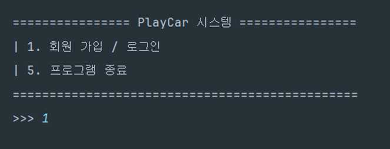

---

# User Service 관련 

## 회원 관리 시스템 화면
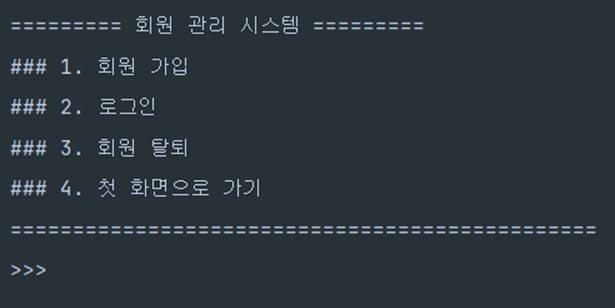

---

## 회원가입 진행
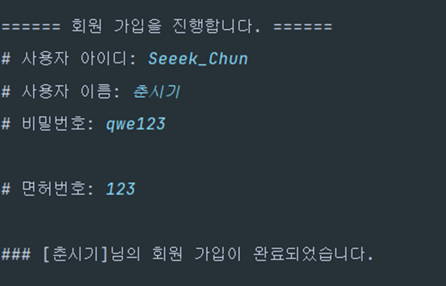
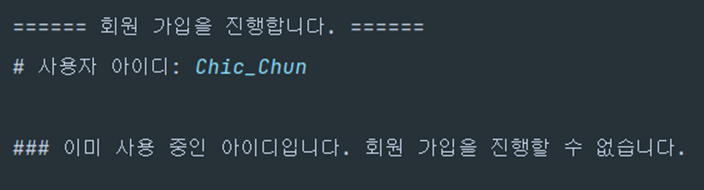

---

## 회원 탈퇴
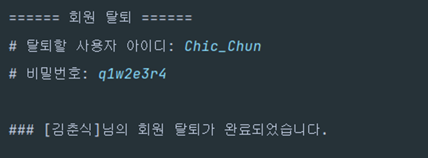

---

## 로그인/로그아웃 화면

### 로그인 성공
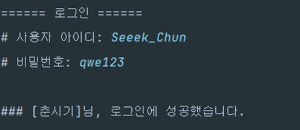

### 로그아웃
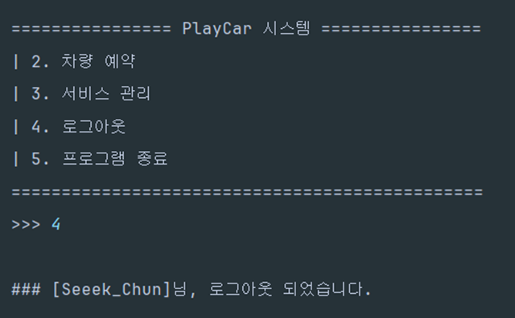

---

## 로그인 후 메인 화면

---

# Reservation Service 관련 

## 차량 예약
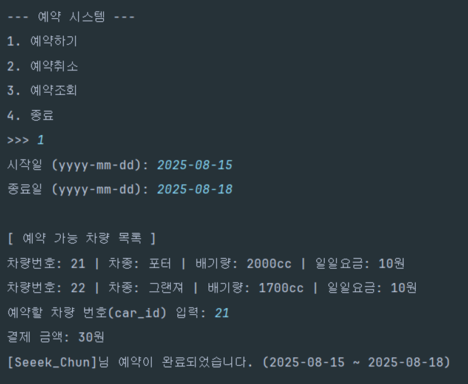

---

## 차량 예약 조회
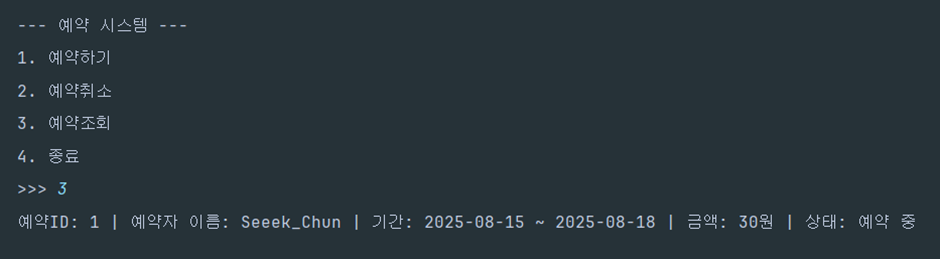

---

## 예약 취소
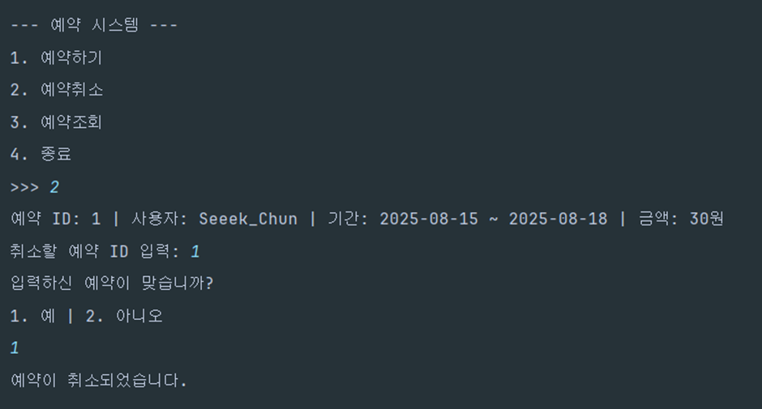

---

## 서비스 진입 실패
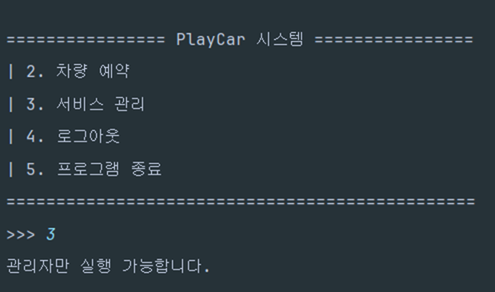

---

# Car Service 관련 

## 차량 추가
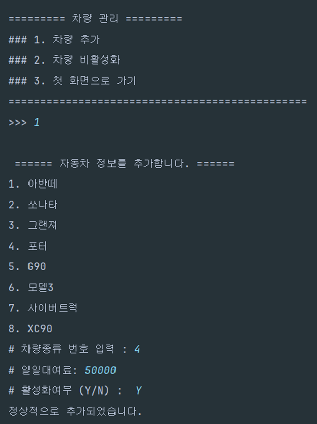

---

## 차량 비활성화
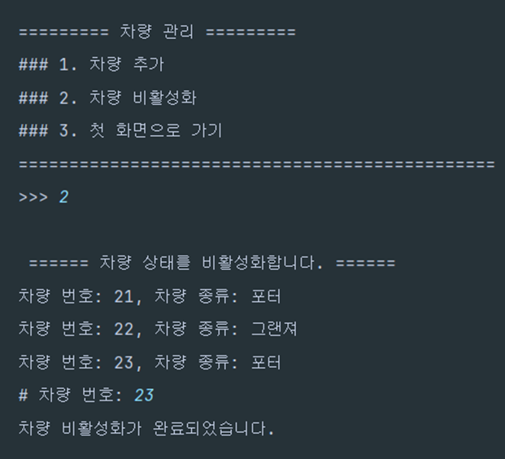

---

## 프로그램 종료
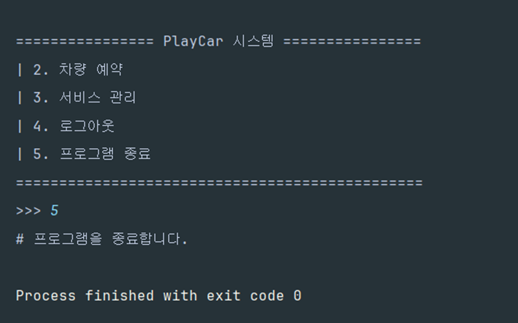
